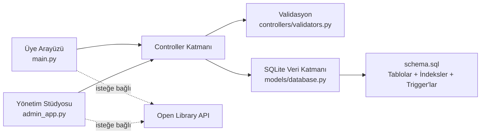

<div align="center">

# ◈ Lumina

### Hikâyeler burada ışık bulur.

Python, SQLite ve CustomTkinter ile geliştirilen; üye deneyimi ile yönetim operasyonlarını ayrı arayüzlerde birleştiren modern kütüphane yönetim sistemi.


</div>

## Proje özeti

Lumina, Faz 2 **Proje 1 – Kütüphane Yönetim Sistemi** için **Python + SQL + GitHub** teknoloji kombinasyonuyla hazırlanmıştır. Uygulama kitap, üye ve ödünç işlemlerinin CRUD akışlarını; güvenli kimlik doğrulamayı, stok/ceza otomasyonunu ve açıklayıcı testleri tek projede sunar.

İki farklı masaüstü deneyimi vardır:

- **Üye uygulaması:** katalog, anlık arama, kitap detayları, ödünç/iade, bildirimler, kitap isteği, profil talebi ve tema seçimi.
- **Yönetim stüdyosu:** gösterge paneli, kitap/üye CRUD, üyelik onayı, tüm ödünç geçmişi, manuel iade, Open Library entegrasyonu ve talep yönetimi.

## Neden farklı?

- **Aurora tasarım sistemi:** koyu lacivert zemin, mor vurgu, turkuaz başarı ve mercan uyarı renklerinden oluşan Lumina'ya özel palet.
- **Geçmişi koruyan arşivleme:** kitap ve üyeler doğrudan yok edilmez; aktif ödünç kontrolünden sonra arşivlenir.
- **Veritabanı seviyesinde güvence:** stok düşürme, iade, gecikme cezası ve denetim günlüğü SQLite trigger'larıyla korunur.
- **Eşzamanlı işlem güvenliği:** ödünç işlemleri `BEGIN IMMEDIATE`, busy timeout ve atomik transaction kullanır.
- **Savunmacı doğrulama:** ISBN-10/13 checksum, e-posta, telefon, parola, yıl, URL ve kopya sayısı doğrulanır.
- **Dış servis zarif düşüşü:** Open Library veya kapak servisi erişilemezse temel kütüphane işlevleri çalışmaya devam eder.

## Özellik matrisi

| Modül | Oluştur | Oku | Güncelle | Sil / Arşivle |
|---|:---:|:---:|:---:|:---:|
| Kitap | ✓ | ✓ | ✓ | ✓ |
| Üye | ✓ | ✓ | ✓ (onay/profil talebi) | ✓ |
| Ödünç | ✓ | ✓ | ✓ (iade) | Denetim geçmişi korunur |
| Kitap isteği | ✓ | ✓ | ✓ (onay/ret) | ✓ |
| Bildirim | ✓ | ✓ | ✓ (okundu) | Üye silinince cascade |

## Mimari



Arayüz yalnız kullanıcı etkileşimini yönetir; iş kuralları controller katmanında, veri bütünlüğü ise hem controller transaction'larında hem SQL şemasında uygulanır.

## Teknolojiler

- Python 3.10+
- SQLite 3
- CustomTkinter
- bcrypt
- Pillow
- Requests
- pytest ve Ruff
- GitHub Actions

## Hızlı başlangıç

### 1. Ortamı hazırlayın

```bash
git clone <depo-adresi>
cd <depo-klasoru>
python -m venv .venv
```

Windows PowerShell:

```powershell
.\.venv\Scripts\Activate.ps1
python -m pip install -r requirements.txt
```

macOS / Linux:

```bash
source .venv/bin/activate
python -m pip install -r requirements.txt
```

### 2. Demo kataloğunu yükleyin

```bash
python seed_db.py
```

Komut mevcut verileri silmez; eksik demo hesabını ve kitapları idempotent biçimde ekler. Tamamen temiz demo veritabanı istenirse açıkça şu komut kullanılır:

```bash
python seed_db.py --reset
```

> `--reset` mevcut yerel veritabanı içeriğini siler.

### 3. Uygulamaları açın

Üye uygulaması:

```bash
python main.py
```

Yönetim stüdyosu:

```bash
python admin_app.py
```

## Demo hesapları

`seed_db.py` çalıştırıldıktan sonra:

| Rol | Kullanıcı | Parola |
|---|---|---|
| Yönetici | `admin` | `Admin123!` |
| Üye | `uye@lumina.local` | `Uye12345!` |

İlk veritabanı oluşturulmadan önce yönetici bilgileri ortam değişkenleriyle değiştirilebilir:

```powershell
$env:LUMINA_ADMIN_USERNAME = "yonetici"
$env:LUMINA_ADMIN_PASSWORD = "GucluBirParola123!"
python admin_app.py
```

> Demo parolaları yalnız yerel değerlendirme içindir. Gerçek kullanımda hemen değiştirilmelidir. Mevcut veritabanları yükseltilirken hesaplar ve parolalar korunur.

## Test ve kalite

Geliştirme bağımlılıklarını kurun:

```bash
python -m pip install -r requirements-dev.txt
```

Tüm kontroller:

```bash
python -m compileall -q .
ruff check .
pytest -q
```

Test paketi geçici veritabanları kullanır; `library.db` dosyanıza dokunmaz. Ayrıntılı kapsam [test planında](docs/TEST_PLAN.md) yer alır. Aynı kontroller her push ve pull request'te GitHub Actions tarafından çalıştırılır.

## SQL tasarımı

Ana tablolar:

- `admins`, `members`, `books`, `borrows`
- `book_requests`, `profile_requests`, `notifications`
- `reviews`, `wishlist`, `reservations`, `audit_logs`

Önemli kurallar:

- Her SQLite bağlantısında foreign key denetimi açılır.
- ISBN ve e-posta alanları benzersizdir.
- `available_copies`, `0 <= mevcut <= toplam` koşulunu sağlar.
- Stok dışı doğrudan SQL ödünç eklemesi `before_borrow_insert` trigger'ı tarafından reddedilir.
- İade trigger'ı stoğu yalnız ilk iadede artırır ve günlük 5 TL gecikme cezası hesaplar.
- Arama, aktif ödünç ve bildirim sorguları indekslenmiştir.

Tam şema [schema.sql](schema.sql), JOIN/GROUP BY rapor örnekleri [reports.sql](reports.sql) dosyasındadır.

## Proje yapısı

```text
Lumina/
├── main.py                     # Üye uygulaması
├── admin_app.py                # Yönetim stüdyosu
├── seed_db.py                  # İdempotent demo veri yükleyici
├── schema.sql                  # Tablolar, indeksler ve trigger'lar
├── reports.sql                 # JOIN / GROUP BY rapor sorguları
├── requirements.txt            # Çalışma zamanı bağımlılıkları
├── requirements-dev.txt        # Test ve kalite araçları
├── controllers/
│   ├── auth.py                 # Kimlik ve parola işlemleri
│   ├── library.py              # Kitap, üye, ödünç ve talep iş kuralları
│   └── validators.py           # Merkezi veri doğrulama
├── models/
│   └── database.py             # Bağlantı, transaction ve şema geçişleri
├── views/
│   ├── theme.py                # Lumina Aurora tasarım sistemi
│   ├── ui.py                   # Üye arayüzü
│   └── admin_ui.py             # Yönetici arayüzü
├── tests/
│   ├── test_core.py            # İş kuralı entegrasyon testleri
│   └── test_sql_artifacts.py   # SQL teslim dosyası testleri
├── docs/
│   └── TEST_PLAN.md            # Test kapsamı ve kabul ölçütleri
└── .github/workflows/tests.yml # CI kalite kapısı
```

`library.db` ilk çalıştırmada otomatik oluşur ve kişisel veri içerebileceği için Git'e eklenmez.

## Güvenlik notları

- Parolalar düz metin tutulmaz; bcrypt ile salt'lı hash saklanır.
- SQL sorguları parametreli çalışır.
- Görsel indirmeleri 5 MB ile sınırlıdır ve ağ çağrıları timeout kullanır.
- Üye bildirimi sahiplik denetimiyle okundu işaretlenir.
- Hassas yerel dosyalar ve veritabanları `.gitignore` kapsamındadır.

## Teslim kontrol listesi

- [x] Python + SQL teknoloji kombinasyonu
- [x] Kitap, üye ve ödünç CRUD akışları
- [x] SQLite bağlantısı, şema ve SQL raporları
- [x] Üye ve yönetici GUI'leri
- [x] Otomatik testler ve manuel test planı
- [x] GitHub Actions kalite kontrolü
- [x] Açıklayıcı README ve proje yapısı

---

Lumina, eğitim projesi sınırlarının ötesinde; izlenebilir, test edilebilir ve güvenli bir masaüstü kütüphane uygulaması örneği olarak tasarlanmıştır.
